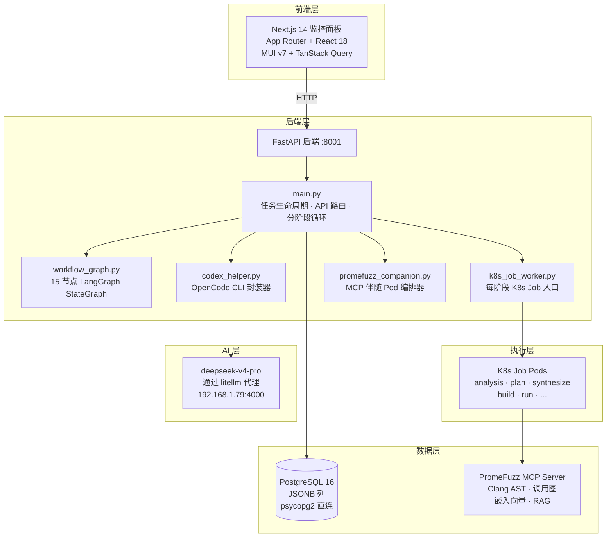
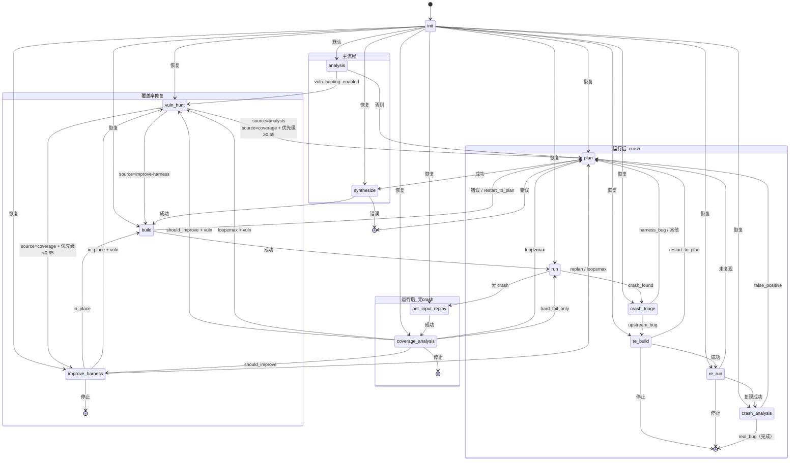
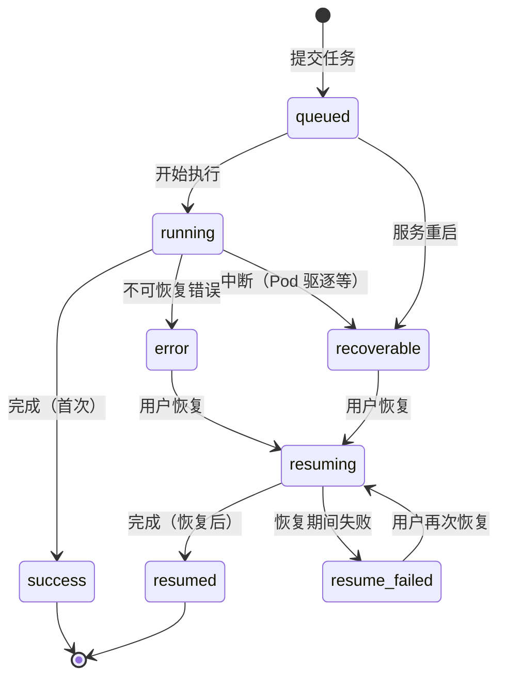
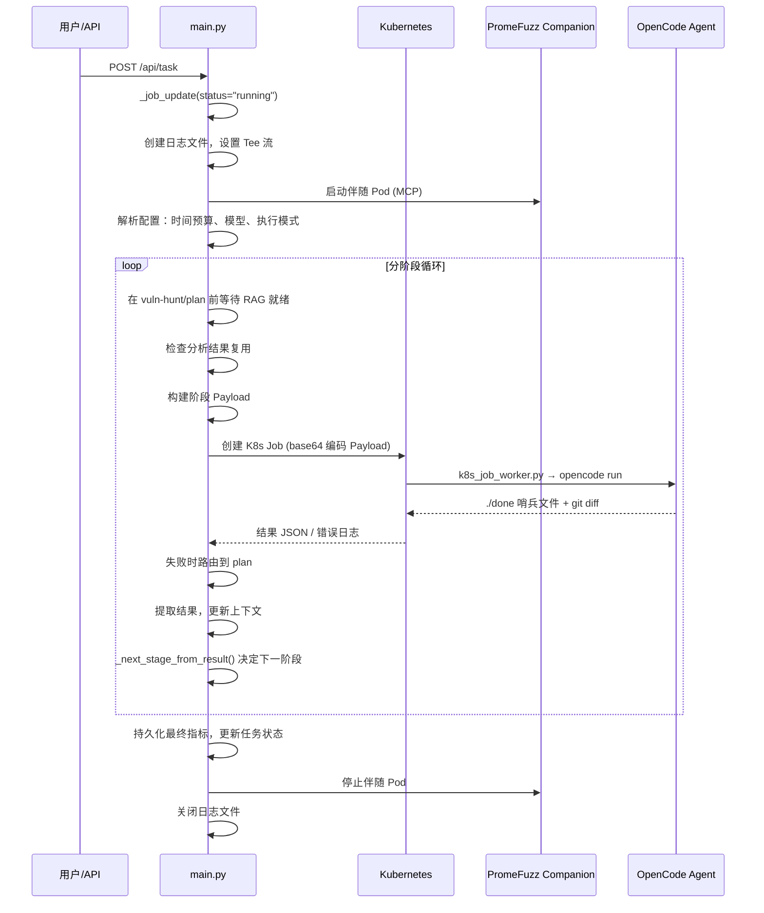
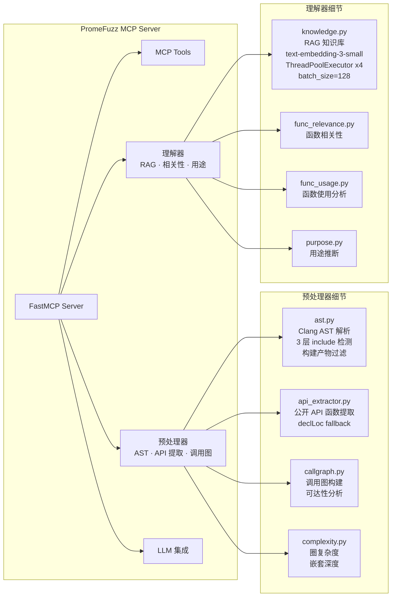
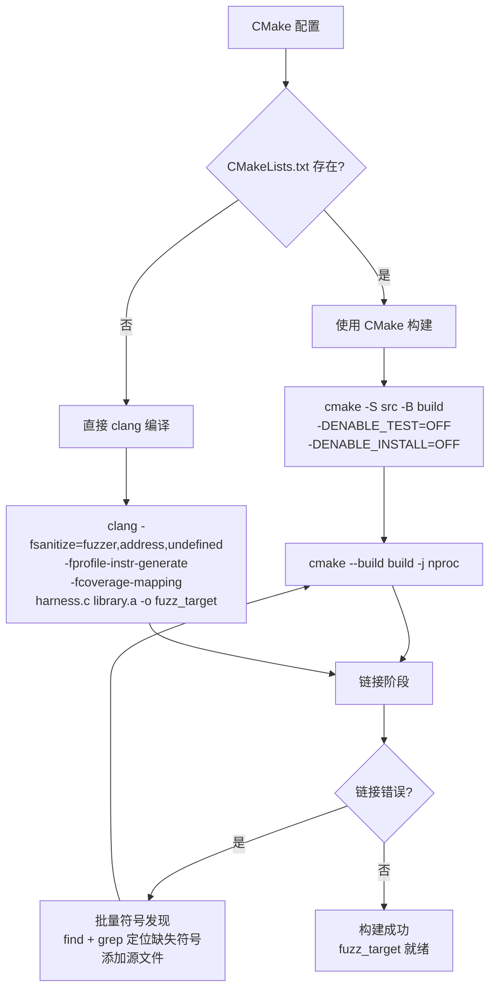
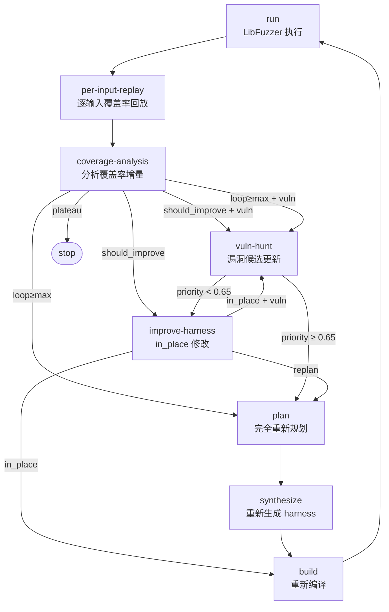
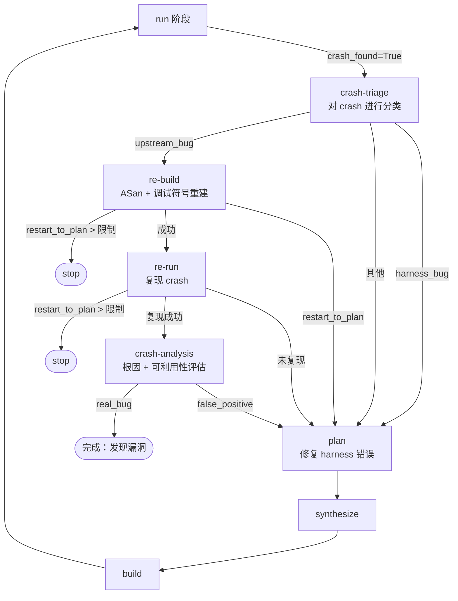
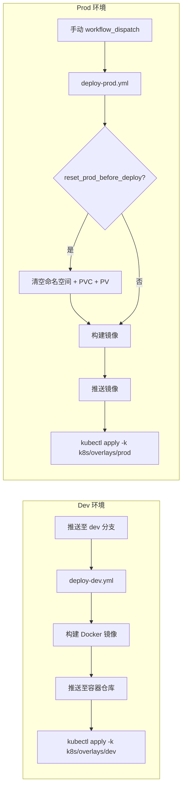

# SHERPA（天衡）— 企业知识库

## 文档目的

本文档是天衡（Sherpa）自动化模糊测试编排系统的权威技术参考。涵盖系统架构、工作流引擎、AI Agent 集成、代码分析管线、部署基础设施、配置项、数据 Schema 以及调试流程。目标读者：企业合作伙伴、集成工程师、系统运维人员。

---

## 目录

1. [系统架构](#1-系统架构)
2. [工作流状态机](#2-工作流状态机)
3. [工作流阶段详解](#3-工作流阶段详解)
4. [API 与任务生命周期](#4-api-与任务生命周期)
5. [PromeFuzz 代码分析管线](#5-promefuzz-代码分析管线)
6. [OpenCode AI Agent 集成](#6-opencode-ai-agent-集成)
7. [Kubernetes 编排](#7-kubernetes-编排)
8. [构建与 Fuzzing 引擎](#8-构建与-fuzzing-引擎)
9. [覆盖率反馈循环](#9-覆盖率反馈循环)
10. [Crash 处理路径](#10-crash-处理路径)
11. [部署架构](#11-部署架构)
12. [配置参考](#12-配置参考)
13. [数据 Schema 与字段参考](#13-数据-schema-与字段参考)
14. [调试与运维](#14-调试与运维)

---

## 1. 系统架构

### 1.1 整体架构图



### 1.2 技术栈

| 层级 | 技术 | 用途 |
|---|---|---|
| **后端** | Python 3.12+ / FastAPI（端口 8001） | API 服务器、任务管理、工作流编排 |
| **工作流引擎** | LangGraph（StateGraph） | 15 节点 DAG 条件路由，支持从任意阶段恢复 |
| **前端** | Next.js 14 App Router + React 18 + MUI v7 + TanStack Query | 监控面板 |
| **AI Agent** | OpenCode CLI（`opencode`） | 通过 LLM 进行各阶段代码生成 |
| **LLM** | deepseek-v4-pro 通过 litellm 代理（`192.168.1.79:4000`） | 模型推理服务 |
| **代码分析** | PromeFuzz MCP Server（Clang AST、调用图、嵌入向量） | 静态分析、API 提取、语义 RAG |
| **数据库** | PostgreSQL 16（psycopg2，无 ORM，JSONB 列） | 任务状态持久化 |
| **编排** | Kubernetes（Kustomize overlays：base/dev/prod/cloudflare） | Job 执行、服务部署 |
| **模糊测试** | LibFuzzer + Clang（Address/Undefined Sanitizer，覆盖率插桩） | 模糊测试执行 |
| **CI/CD** | GitHub Actions（`deploy-dev.yml`、`deploy-prod.yml`） | 自动化部署 |

### 1.3 仓库结构

```
harness_generator/src/langchain_agent/
├── main.py                         # FastAPI 应用（5300+ 行），全部 API 路由、_run_fuzz_job
├── workflow_graph.py               # LangGraph StateGraph（16450+ 行），15 节点 + 路由逻辑
├── codex_helper.py                 # OpenCode CLI 封装器（1600+ 行，位于 harness_generator/src/）
├── k8s_job_worker.py               # K8s Job 执行器（Pod 内运行为入口）
├── promefuzz_companion.py           # PromeFuzz MCP 伴随编排器（K8s Pod 生命周期管理）
├── job_store.py                    # InMemoryJobStore + PostgresJobStore（192 行）
├── persistent_config.py            # WebPersistentConfig、环境变量覆盖、模型名称规范化
├── workflow_common.py              # 共享工作流工具
├── workflow_coverage_decision.py   # 覆盖率改进决策逻辑
├── workflow_target_scoring.py      # 目标漏洞评分
├── workflow_target_selection.py    # 从候选项中选择目标
├── workflow_observability.py       # 可观测性钩子
├── workflow_context_store.py       # 上下文目录读写合并
├── errors.py                       # K8sJobError、TianHengError
├── opencode_skills/                # AI Agent 合约（每个阶段一个 SKILL.md）
│   ├── analysis/ plan/ synthesize/ synthesize_complete_scaffold/
│   ├── seed_generation/ fix_build/
│   ├── fix_harness_after_run/ improve_harness_in_place/
│   ├── crash_analysis/ crash_triage/
│   ├── fix_crash_harness_error/ fix_crash_upstream_bug/
│   └── vuln_hunt/
harness_generator/src/
├── harness_generator.py            # 核心 harness 生成引擎
├── fuzz_unharnessed_repo.py        # Fuzzer 执行器（构建、运行、crash 提取）
promefuzz-mcp/                       # MCP 代码分析服务器（Python）
├── promefuzz_mcp/
│   ├── server.py / server_tools.py # MCP 服务器 + 工具注册
│   ├── preprocessor/
│   │   ├── ast.py                  # Clang AST 预处理器（3 层 include 检测）
│   │   ├── api_extractor.py        # API 函数提取
│   │   ├── callgraph.py            # 调用图构建
│   │   ├── complexity.py           # 复杂度分析
│   │   └── relevance.py            # 相关性评分
│   ├── comprehender/
│   │   ├── knowledge.py            # RAG 知识库（嵌入向量 + 检索）
│   │   ├── func_relevance.py       # 函数相关性分析
│   │   ├── func_usage.py           # 函数使用分析
│   │   └── purpose.py              # 用途推断
│   └── build.py                    # 构建工具
frontend-next/                       # Next.js 14 监控面板
docker/                              # Dockerfiles（web、frontend、gateway、opencode、fuzz*）
k8s/                                 # Kustomize overlays（base、dev、prod、cloudflare）
```

---

## 2. 工作流状态机

### 2.1 StateGraph 架构

系统使用带有类型化状态字典 `FuzzWorkflowRuntimeState`（约 200 个字段）的 **LangGraph StateGraph**。该图包含 15 个节点，通过条件边连接。每个节点对应一个工作流阶段，以独立的 Kubernetes Job 形式调度执行。

StateGraph 在 `workflow_graph.py:build_fuzz_workflow()`（第 16300 行）中构建。

### 2.2 15 节点全景图



### 2.3 完整路由逻辑（已与源码验证）

每条条件边在 `workflow_graph.py` 中定义。以下是精确的路由逻辑：

#### `_route_after_build_state`（第 15956 行）
| 条件 | 下一节点 |
|---|---|
| `restart_to_plan` 为 True | `plan` |
| 无错误负载 | `run` |
| 存在错误 | `plan` |

#### `_route_after_run_state`（第 15966 行）
| 条件 | 下一节点 |
|---|---|
| `restart_to_plan` 为 True | `plan` |
| `crash_found` 为 True | `crash-triage` |
| `run_terminal_reason` = `coverage_plateau` | `per-input-replay` |
| `run_error_kind` 属于可恢复类型 | `per-input-replay` |
| `run_error_kind` 属于致命类型 | `plan` |
| `run_error_kind` 存在（未知类型） | `plan` |
| 默认 | `per-input-replay` |

#### `_route_after_per_input_replay_state`（第 15990 行）
| 条件 | 下一节点 |
|---|---|
| `failed` 或终端错误 | `stop` |
| `last_error` 非空 | `stop` |
| 默认 | `coverage-analysis` |

#### `_route_after_coverage_analysis_state`（第 16000 行）
| 条件 | 下一节点 |
|---|---|
| `failed` 或终端错误 / `last_error` 非空 | `stop` |
| `coverage_should_improve` + vuln 启用 | `vuln-hunt` |
| `coverage_should_improve`（vuln 未启用） | `improve-harness` |
| `loop_count >= SHERPA_MAX_CONTINUOUS_LOOP`（默认 3）+ vuln | `vuln-hunt` |
| `loop_count >= max`（vuln 未启用） | `plan` |
| `auto_stop_policy` = "hard_fail_only" | `run` |
| 默认 | `stop` |

#### `_route_after_improve_harness_state`（第 16027 行）
| 条件 | 下一节点 |
|---|---|
| `failed` 或终端错误 / `last_error` 非空 | `stop` |
| `loop_count >= SHERPA_MAX_CONTINUOUS_LOOP`（默认 3） | `plan` |
| `coverage_improve_mode` = "replan" + 无效 | `stop`（hard_fail_only 模式下为 `plan`） |
| `coverage_round_budget_exhausted` | `stop`（hard_fail_only 模式下为 `plan`） |
| `coverage_should_improve` + vuln + in_place | `vuln-hunt` |
| `coverage_should_improve` + in_place | `build` |
| `coverage_should_improve` + replan | `plan` |
| 默认 | `stop` |

#### `_route_after_analysis_state`（第 16066 行）
| 条件 | 下一节点 |
|---|---|
| `failed` 或终端错误 | `stop` |
| `last_error` 非空 + 非 `analysis_degraded` | `stop` |
| `vuln_hunting_enabled` | `vuln-hunt` |
| 默认 | `plan` |

#### `_route_after_vuln_hunt_state`（第 16268 行）
| 条件 | 下一节点 |
|---|---|
| `failed` 或 `last_error` 非空 | `stop` |
| `source` = "improve-harness" | `build` |
| `source` = "coverage-analysis" + 优先级 ≥ 0.65 | `plan` |
| `source` = "coverage-analysis" + 优先级 < 0.65 | `improve-harness` |
| `source` = "analysis"（初始） | `plan` |

#### `_route_after_crash_triage_state`（第 16120 行）
| 条件 | 下一节点 |
|---|---|
| `failed` | `stop` |
| `restart_to_plan` | `plan` |
| `crash_triage_label` = "harness_bug" | `plan` |
| `crash_triage_label` = "upstream_bug" | `re-build` |
| 其他标签 | `plan` |

#### `_route_after_re_build_state`（第 16151 行）
| 条件 | 下一节点 |
|---|---|
| `failed` | `stop` |
| `crash_found` 为 False | `stop` |
| `restart_to_plan` + 次数 > 上限（默认 1） | `stop` |
| `restart_to_plan` | `plan` |
| `re_build_done` + `re_build_ok` | `re-run` |

#### `_route_after_re_run_state`（第 16165 行）
| 条件 | 下一节点 |
|---|---|
| `failed` | `stop` |
| `crash_found` 为 False | `stop` |
| `restart_to_plan` + 次数 > 上限（默认 1） | `stop` |
| `restart_to_plan` | `plan` |
| `crash_repro_done` + 非 `crash_repro_ok` | `plan` |
| `crash_repro_done` + `crash_repro_ok` | `crash-analysis` |

#### `_route_after_crash_analysis_state`（第 16181 行）
| 条件 | 下一节点 |
|---|---|
| `failed` | `stop` |
| `restart_to_plan` + 次数 > 上限 | `stop` |
| `restart_to_plan` | `plan` |
| `crash_analysis_verdict` = "false_positive" | `plan` |
| 真实漏洞 | `stop`（完成） |

#### 简单线性路由（无分支）：
- **plan** → `synthesize`（错误时 stop）
- **synthesize** → `build`（错误时 stop）
- **init** → `analysis`（默认），可从任意允许的阶段恢复

---

## 3. 工作流阶段详解

### 3.1 init（初始化）
- **用途**：入口节点。新任务从 `analysis` 开始，恢复任务可从任意有效阶段开始。
- **核心逻辑**（`_route_after_init_state`，第 16236 行）：
  - 规范化恢复步骤名（`fix_harness` → `plan`，`fix_build`/`fix_crash` → `build`，`vuln_hunt` → `vuln-hunt`，`repro_crash` → `re-build`）
  - 允许的恢复阶段：`analysis`、`vuln-hunt`、`plan`、`synthesize`、`build`、`run`、`per-input-replay`、`crash-triage`、`coverage-analysis`、`improve-harness`、`re-build`、`re-run`、`crash-analysis`
- **输入状态字段**：`resume_from_step`、`resume_repo_root`、`failed`、`last_error`
- **输出**：路由到解析后的阶段

### 3.2 analysis（代码分析）
- **用途**：静态代码分析——AST 预处理、API 提取、调用图构建、漏洞证据收集。
- **SKILL.md**：`opencode_skills/analysis/SKILL.md`
- **Agent 任务**：
  1. 查询 PromeFuzz MCP 获取代码导航信息（`list_definitions`、`read_definition`、`read_source`、`find_references`）
  2. 运行 AST 预处理器提取函数定义并构建调用图
  3. 生成 `fuzz/vuln_hypotheses.md`，包含 3-8 个高信号假设
  4. 在 `analysis_context.json` 中填充 `security_evidence[]` 和 `vuln_candidate_inventory[]`
- **关键输出**：`fuzz/analysis_context.json`、`fuzz/vuln_hypotheses.md`、`fuzz/target_analysis.json`
- **约束**：受限分析模式——最多 6 次额外 MCP 读取。禁止重新分类目标类型。vuln_hypotheses.md 控制在 120 行以内。
- **超时**：默认 300 秒（`SHERPA_ANALYSIS_OPENCODE_IDLE_TIMEOUT_SEC`）

### 3.3 vuln-hunt（漏洞搜索）
- **用途**：在执行规划前发现、更新和排序漏洞候选目标。
- **SKILL.md**：`opencode_skills/vuln_hunt/SKILL.md`
- **Agent 任务**：
  1. 读取 `fuzz/analysis_context.json` 获取 `security_evidence[]`
  2. 读取/更新 `fuzz/vuln_candidates.json`（validation_status、attempt_count、结果）
  3. 纯漏洞风险排序：`likelihood + exploitability + reachability`
  4. 按迭代校准：
     - 第 1-2 轮：基于静态分析的广泛候选
     - 第 3-4 轮：聚焦有 crash/覆盖率证据的候选
     - 第 5 轮及以上：对照最新数据重新评估已耗尽的候选
  5. 随着证据积累，逐轮提高置信度
- **关键输出**：`fuzz/vuln_candidates.json`、`fuzz/vuln_hunt_summary.md`
- **约束**：降低 test/demo/legacy 代码、清理函数、test-helper 的优先级。仅允许只读命令。
- **超时**：默认 1800 秒（`SHERPA_OPENCODE_IDLE_TIMEOUT_VULN_HUNT_SEC`）

### 3.4 plan（执行规划）
- **用途**：产出运行时可行的模糊测试目标和执行计划工件。
- **SKILL.md**：`opencode_skills/plan/SKILL.md`
- **Agent 任务**：
  1. 首先读取 `fuzz/vuln_candidates.json`（主要目标来源）
  2. 评分公式：`score_total = 0.50*vuln_likelihood + 0.30*exploitability + 0.20*reachability_confidence - recent_yield_penalty`
  3. 产出 `fuzz/targets.json`（非空数组）
  4. 产出 `fuzz/execution_plan.json`，包含 `execution_priority`、`must_run`、`target_name`、`expected_fuzzer_name`、`seed_profile`
- **关键输出**：`fuzz/PLAN.md`、`fuzz/targets.json`、`fuzz/execution_plan.json`
- **约束**：`risk_type` 必须继承自 `vuln_candidates.json`。`api` 必须是 API 标识符而非 harness 路径。降低 test/demo 代码、格式门控入口点、清理函数的优先级。
- **超时**：默认 1200 秒（`SHERPA_OPENCODE_IDLE_TIMEOUT_PLAN_SEC`）

### 3.5 synthesize（代码生成）
- **用途**：生成完整的模糊测试脚手架（harness 源码、构建脚本、运行时事实）。
- **SKILL.md**：`opencode_skills/synthesize/SKILL.md`
- **Agent 任务**：
  1. 读取规划工件：`PLAN.md`、`targets.json`、`selected_targets.json`、`execution_plan.json`
  2. 查询 MCP 获取代码导航 + 预处理器证据
  3. 创建 harness 源文件（harness-first 合约——源码先于文档）
  4. 创建 `fuzz/build.py` 或 `fuzz/build.sh`（集成 CMake）
  5. 创建 `fuzz/repo_understanding.json`、`fuzz/build_strategy.json`、`fuzz/build_runtime_facts.json`
  6. 创建与 `execution_plan.json` 对齐的 `fuzz/harness_index.json`
- **关键输出**：`*.c`/`*.cc` harness 文件、`fuzz/build.py`、`fuzz/repo_understanding.json`、`fuzz/build_strategy.json`、`fuzz/build_runtime_facts.json`、`fuzz/harness_index.json`
- **硬性合约**：
  - 仅允许为 `fuzz/targets.json` 中列出的目标生成 harness
  - `build_system` 禁止为 "unknown"
  - `chosen_target_api` 必须是 API 标识符，禁止为 harness 路径
  - `DEFAULT_CMAKE_ARGS = ["-DENABLE_TEST=OFF", "-DENABLE_INSTALL=OFF"]`
  - 必须使用系统 `cmake` 命令，禁止使用 `python -m cmake`
- **超时**：默认 300 秒（`SHERPA_OPENCODE_IDLE_TIMEOUT_SYNTH_SEC`）
- **构建验证**：子进程超时默认 1800 秒（`SHERPA_SYNTH_BUILD_VALIDATE_TIMEOUT_SEC`）

### 3.6 build（构建）
- **用途**：使用 Clang + LibFuzzer + 覆盖率插桩编译 harness。
- **构建配置**：
  - 编译器：`clang`
  - Fuzzer 标志：`-fsanitize=fuzzer,address,undefined`
  - 覆盖率：`-fprofile-instr-generate -fcoverage-mapping`（用于后续回放）
  - 并行构建：`-j $(nproc)`
- **核心逻辑**：`codex_helper.py` 中的第二步通过批量符号发现（`SHERPA_FIX_BUILD_BATCH_DISCOVERY=1`）迭代解决未定义引用。每次修复后重新构建并检查新错误。
- **输出**：编译完成的 fuzzer 二进制文件
- **超时**：构建默认 1800 秒，各步骤有子超时
- **失败处理**：错误或 `restart_to_plan` 时路由回 `plan`

### 3.7 run（模糊测试运行）
- **用途**：对编译好的 harness 执行 LibFuzzer，收集覆盖率数据和 crash 工件。
- **Fuzzing 设置**：
  - LibFuzzer 标志：`-max_len=4096`、`-rss_limit_mb=4096`、可配置的 `-max_total_time`
  - 每个二进制支持多个并行 fuzzer 实例（运行时并行度估算）
  - 每个输入的覆盖率收集
- **关键标志**：
  - `crash_found`：布尔值，表示检测到 crash
  - `run_terminal_reason`：运行终止原因（如 `coverage_plateau`、超时）
  - `run_error_kind`：运行错误分类（可恢复 vs 致命）
- **健康输出模式**：`#8192 pulse cov: 35 ft: 35 corp: 6/549b exec/s: 744`
- **超时**：通过 `total_time_budget`/`run_time_budget` 字段可配置

### 3.8 per-input-replay（逐输入回放）
- **用途**：使用覆盖率分析工具逐一回放 LibFuzzer 语料库输入，计算每个输入的覆盖率。
- **插桩**：Clang 源码级代码覆盖率标志 `-fprofile-instr-generate -fcoverage-mapping`
- **输出**：`coverage-analysis` 所需的每个输入的覆盖率数据

### 3.9 coverage-analysis（覆盖率分析）
- **用途**：分析轮次间的覆盖率增量。决定是继续改进、更换目标还是停止。
- **关键决策**：
  - `coverage_should_improve`：有实质性改进空间时为 True
  - `continuous_loop_count`：每轮无改进时递增
  - 熔断器：`SHERPA_MAX_CONTINUOUS_LOOP`（默认 3）强制重新规划或停止
- **输出**：路由到 `vuln-hunt`、`improve-harness`、`plan` 或 `stop`

### 3.10 improve-harness（改进 harness）
- **用途**：在无需完全重新规划的情况下修改现有 harness 以提升覆盖率。
- **两种模式**：
  - `in_place`：小幅修改（添加种子、调整输入）→ 直接进入 `build`
  - `replan`：需要重大变更 → 路由回 `plan`
- **熔断器**：`SHERPA_MAX_CONTINUOUS_LOOP` 次循环后强制重新规划
- **预算耗尽**：`coverage_round_budget_exhausted` 触发停止（hard_fail_only 模式下为 plan）

### 3.11 crash-triage（crash 分类）
- **用途**：分类 crash 工件，确定根本原因类别。
- **分类标签**：
  - `harness_bug`：harness 自身错误 → 路由到 `plan` 进行修复
  - `upstream_bug`：目标库中的真实漏洞 → 路由到 `re-build` 进行复现
  - 其他：→ 路由到 `plan`
- **SKILL.md**：`opencode_skills/crash_triage/SKILL.md`

### 3.12 re-build（重新构建）
- **用途**：使用特定的 crash 复现插桩重新构建 harness。
- **路由**：成功 → `re-run`。`restart_to_plan` 超过上限（默认 1） → 停止。
- **熔断器**：`SHERPA_RESTART_FROM_PLAN_MAX`（默认 1）限制 plan 重新开始的次数

### 3.13 re-run（重新运行）
- **用途**：重新执行 harness 以复现 crash。
- **输出**：`crash_repro_done`（布尔值）、`crash_repro_ok`（布尔值）
- **路由**：复现成功 → `crash-analysis`。未复现 → `plan`。

### 3.14 crash-analysis（crash 分析）
- **用途**：分析复现的 crash 以确定根本原因和可利用性。
- **判定**：
  - `false_positive`：非真实漏洞 → 路由到 `plan`
  - `real_bug`：已确认漏洞 → 停止（成功完成）
- **SKILL.md**：`opencode_skills/crash_analysis/SKILL.md`

---

## 4. API 与任务生命周期

### 4.1 REST API 端点（FastAPI，端口 8001）

| 方法 | 路径 | 用途 | 请求体 |
|---|---|---|---|
| POST | `/api/task` | 提交新的模糊测试任务 | `fuzz_model`（见 Schema） |
| GET | `/api/task/{job_id}` | 获取单个任务详情 | — |
| POST | `/api/task/{job_id}/resume` | 恢复中断/崩溃的任务 | — |
| POST | `/api/task/{job_id}/stop` | 请求优雅停止 | — |
| GET | `/api/tasks` | 列出所有任务（支持筛选） | — |
| GET | `/api/system` | 系统健康 + 指标 | — |
| GET | `/api/config` | 获取运行时配置 | — |
| GET | `/healthz` | Kubernetes 存活探针 | — |

### 4.2 任务提交模型（`fuzz_model`）

```json
{
  "code_url": "https://github.com/org/repo.git",
  "code_branch": "main",
  "email": "user@example.com",
  "max_tokens": 65536,
  "total_time_budget": 86400,
  "run_time_budget": 3600,
  "unlimited_round_limit": 0,
  "model": "deepseek-reasoner",
  "target_language": "c",
  "vuln_hunting": true,
  "coverity_scan": false,
  "docker_image": ""
}
```

| 字段 | 类型 | 默认值 | 说明 |
|---|---|---|---|
| `code_url` | string | (必填) | Git 仓库 URL |
| `code_branch` | string | `"main"` | 要克隆的分支 |
| `email` | string | `""` | 通知邮箱 |
| `max_tokens` | int | 65536 | 每次 LLM 请求的 token 上限 |
| `total_time_budget` | int | 86400 | 任务总时间预算（秒）。0 = 不限 |
| `run_time_budget` | int | 3600 | 每次运行的 fuzzing 时间（秒）。0 = 不限 |
| `unlimited_round_limit` | int | 0 | 无限轮次预算（秒）。0 = 不限 |
| `model` | string | `"deepseek-reasoner"` | LLM 模型标识符 |
| `target_language` | string | `"c"` | 目标语言："c" 或 "cpp" |
| `vuln_hunting` | bool | true | 启用漏洞搜索子阶段 |
| `docker_image` | string | `""` | 自定义 Docker 镜像覆盖 |

### 4.3 任务状态机



- **`queued`**：任务已接受，尚未开始
- **`running`**：任务正在执行（首次运行）
- **`resuming`**：中断后正在重新执行
- **`success`**：任务成功完成（首次运行）
- **`resumed`**：任务成功完成（恢复后）
- **`error`**：任务因不可恢复错误而失败
- **`recoverable`**：任务中断但可恢复（服务重启、Pod 驱逐）
- **`resume_failed`**：任务在恢复尝试期间失败

### 4.4 任务生命周期编排（`_run_fuzz_job`，main.py:4474）



### 4.5 恢复逻辑

任务因 Pod 重启或显式停止而中断后，可从任意阶段恢复。恢复机制：
1. 从任务状态中读取 `resume_from_step` 和 `resume_repo_root`
2. 如果缺少步骤/路径信息，从日志文本推断检查点
3. 根据恢复阶段设置 `_vuln_hunt_entry_source`
4. 重新启动伴随 Pod，重新进入分阶段循环

---

## 5. PromeFuzz 代码分析管线

### 5.1 架构

PromeFuzz 是一个 MCP（Model Context Protocol）服务器，为 AI Agent 提供代码分析工具。它作为伴随 K8s Pod 与每个模糊测试任务一起运行。



### 5.2 组件模块

```
promefuzz-mcp/promefuzz_mcp/
├── server.py          # MCP 服务器入口（FastMCP）
├── server_tools.py    # 工具注册（暴露给 Agent 的 MCP 工具）
├── config.py          # 服务器配置
├── preprocessor/
│   ├── ast.py         # Clang AST 预处理器
│   ├── api_extractor.py  # 从 AST 提取 API 函数
│   ├── callgraph.py   # 调用图构建
│   ├── complexity.py  # 圈复杂度、嵌套深度
│   ├── incidental.py  # 附属函数检测
│   └── relevance.py   # 模糊测试相关性评分
├── comprehender/
│   ├── knowledge.py   # RAG 知识库（嵌入向量、检索）
│   ├── func_relevance.py  # 通过 LLM 的函数相关性分析
│   ├── func_usage.py  # 函数使用分析
│   └── purpose.py     # 用途推断
├── types/             # 类型定义
├── llm/               # LLM 集成工具
├── utils/             # 共享工具函数
└── build.py           # 构建系统检测与工具
```

### 5.3 AST 预处理器（`ast.py`）

**用途**：通过 Clang 解析 C/C++ 源码，提取函数、类型、宏和调用关系。

**Include 路径检测（3 层策略）**：
1. **第 1 层**：标准目录——`include/`、`src/`、`lib/`（及其子目录）
2. **第 2 层**：仓库根目录
3. **第 3 层**：包含 `.h`/`.hpp` 文件的一级子目录

**构建产物过滤**：
- 排除目录：`build/`、`CMakeFiles/`、`_deps/`、`.cache/`、`cmake-build-*/`、`out/`、`dist/`
- 防止扫描生成的代码和第三方代码

**关键输出**：
- `meta.json`：函数元数据（签名、文件位置、复杂度）
- 每个翻译单元的 AST 转储

### 5.4 API 提取器（`api_extractor.py`）

**用途**：从 AST 输出中识别可公开调用的 API 函数。

- 从公开头文件提取函数签名
- 当 `declLoc` 为空时回退到 `func_loc`
- 过滤：忽略 `static` 函数、匿名函数、内部辅助函数
- 输出：`api_functions.json`，包含函数名、签名、文件路径、行号

### 5.5 调用图构建器（`callgraph.py`）

**用途**：从 AST 数据构建函数调用图。

- 节点：函数定义
- 边：调用者 → 被调用者关系
- 输出：Agent 可用于可达性分析的 JSON 调用图

### 5.6 RAG 知识库（`comprehender/knowledge.py`）

**用途**：对代码进行语义搜索以进行相关性和漏洞分析。

- **嵌入模型**：`text-embedding-3-small`（通过 OpenRouter）
- **并发**：`ThreadPoolExecutor`，4 个工作线程
- **批次大小**：128（失败时重试）
- **存储**：向量嵌入，按余弦相似度检索索引
- **关键工具**：`init_knowledge_base`、`retrieve_documents`、`comprehend_*`

### 5.7 MCP 工具（暴露给 Agent）

| 工具 | 类别 | 用途 |
|---|---|---|
| `list_definitions` | 代码导航 | 列出函数/类型定义 |
| `read_definition` | 代码导航 | 读取特定定义 |
| `read_source` | 代码导航 | 读取指定位置的源码 |
| `find_references` | 代码导航 | 查找符号的所有引用 |
| `run_ast_preprocessor` | 预处理器 | 对文件运行 AST 处理 |
| `extract_api_functions` | 预处理器 | 提取公开 API 函数 |
| `build_library_callgraph` | 预处理器 | 为库构建调用图 |
| `init_knowledge_base` | 语义 | 初始化 RAG 索引 |
| `retrieve_documents` | 语义 | 检索相关代码文档 |
| `comprehend_function` | 语义 | 基于 LLM 的函数理解 |
| `comprehend_api` | 语义 | 基于 LLM 的 API 接口分析 |

---

## 6. OpenCode AI Agent 集成

### 6.1 架构

AI Agent 是 OpenCode CLI（`opencode`），通过 `codex_helper.py`（1600+ 行）调用。每个工作流阶段使用特定阶段的 SKILL.md 合约调度 Agent。

### 6.2 调用模型

```bash
opencode run \
  --model <model_name> \
  --max-turns <limit> \
  --allowed-tools "Read,Write,Edit,Bash(cat:grep:find:ls:head:tail:sed:python3:...)" \
  --skill <stage_name> \
  --workspace /repo
```

### 6.3 成功/失败合约

- **成功**：Agent 写入 `./done` 哨兵文件 **且** 产生 `git diff HEAD`
- **失败**：Agent 在超时内未创建 `./done`、agent 崩溃或未产生任何 diff

### 6.4 空闲超时检测

`codex_helper.py` 封装器通过两种机制监控 Agent 活动：

1. **Stdout 活动探针**：如果在空闲超时期限内没有 stdout 输出，则认为 Agent 卡住并将其终止
2. **Git diff 探针**：定期检查 `git diff HEAD` 以检测即使 stdout 被缓冲时的文件更改

空闲超时期限因阶段而异（参见 §12 配置参考）。

### 6.5 重试逻辑

嵌套重试循环，带指数退避：
- **内层重试**：LLM API 错误时重试（限流、瞬时故障）
- **外层重试**：Agent 崩溃、超时或缺少 `./done` 时重试
- 最大重试次数：每个阶段可配置

### 6.6 命令白名单

出于安全考虑，OpenCode 命令受限：
- **允许**：只读命令（`find`、`grep`、`cat`、`ls`、`head`、`tail`、只读 `sed`），构建阶段允许构建命令
- **禁止**：破坏性命令（`rm -rf`、`git push`）、网络访问
- **网络**：Agent 无直接网络访问。所有外部通信通过 MCP 伴随 Pod 进行。

### 6.7 Skill 合约格式

每个 skill 定义为一个带有 YAML frontmatter 的 Markdown 文件：

```yaml
---
name: stage_name
description: 该 skill 的功能
compatibility: opencode
metadata:
  stage: stage_name
  owner: tianheng
---
```

正文包含：所需输入、所需输出、工作流步骤、约束条件、命令策略和验收清单。

### 6.8 僵尸进程检测

Worker 在启动新 Agent 之前检查僵尸/失效的 opencode 进程：
- 阈值：`SHERPA_OPENCODE_DEFUNCT_THRESHOLD`（默认 3）
- 如果僵尸进程数超过阈值，Worker 提前退出并报错

---

## 7. Kubernetes 编排

### 7.1 每阶段 Job 调度

每个工作流阶段都作为一个独立的 **Kubernetes Job** 运行，配置如下：
- **镜像**：`Dockerfile.opencode`（或特定阶段的镜像）
- **入口点**：`harness_generator/src/langchain_agent/` 中的 `k8s_job_worker.py`
- **Payload**：通过 `SHERPA_K8S_WORKER_PAYLOAD_B64` 环境变量注入的 Base64 编码 JSON
- **资源**：可配置的 CPU/内存请求和限制
- **节点固定**：Job 尝试固定到同一 K8s 节点以复用构建产物

```mermaid
sequenceDiagram
    participant Main as main.py
    participant K8s as Kubernetes API
    participant Node as Worker Node
    participant Pod as Job Pod
    participant Worker as k8s_job_worker.py
    participant Agent as OpenCode Agent

    Main->>Main: _build_stage_payload()
    Main->>Main: base64 编码 Payload
    Main->>K8s: 创建 Job (sherpa-fuzz-&lt;id&gt;-&lt;stage&gt;-&lt;seq&gt;)
    K8s->>Node: 调度 Pod
    Node->>Pod: 启动容器
    Pod->>Worker: SHERPA_K8S_WORKER_PAYLOAD_B64
    Worker->>Worker: 解码 Payload，设置工作目录
    Worker->>Agent: opencode run --skill &lt;stage&gt;
    Agent-->>Worker: ./done 哨兵
    Worker->>Worker: 写入结果 JSON，错误日志
    Pod-->>K8s: Job 完成
    K8s-->>Main: 读取结果/错误文件
```

### 7.2 Job 命名规范

```
sherpa-fuzz-<job_id_prefix>-<stage>-<seq>
```

示例：`sherpa-fuzz-6efc2a321b-new-synthesize-38`

组成部分：
- `sherpa-fuzz`：固定前缀
- `6efc2a321b`：10 字符任务 ID 前缀
- `new`：首次运行为 "new"，恢复运行为 "resume"
- `synthesize`：阶段名称
- `38`：调度序号（单调递增）

### 7.3 阶段 Payload 格式

`_build_stage_payload()` 函数构造包含所有所需上下文的 JSON 字典：

```json
{
  "job_id": "f027e851...",
  "repo_url": "https://github.com/...",
  "repo_branch": "main",
  "max_tokens": 65536,
  "total_time_budget_value": 86400,
  "run_time_budget_value": 3600,
  "coverage_loop_max_rounds": 0,
  "max_fix_rounds": 0,
  "same_error_max_retries": 0,
  "email": "",
  "docker_image": null,
  "model_value": "deepseek-reasoner",
  "stage": "analysis",
  "current_repo_root": "/workspace/repos/abc123",
  "context_dir": "/workspace/contexts/abc123",
  "control_ctx": { "time_budget": 86400, ... },
  "unlimited_round_limit_value": 0,
  "companion_url": "http://companion-svc:8080",
  "companion_mcp_ready": true,
  "result_path": "/shared/output/_k8s_jobs/job-id/stage-seq-output.json",
  "error_path": "/shared/output/_k8s_jobs/job-id/stage-seq-error.log",
  "current_node_name": "worker-1",
  "can_pin_node": true
}
```

该 JSON 经 Base64 编码后通过 `SHERPA_K8S_WORKER_PAYLOAD_B64` 传递。

### 7.4 阶段等待超时

等待超时根据预算分配按阶段计算：

| 阶段 | 基础等待时间 | 覆盖环境变量模式 |
|---|---|---|
| analysis | 600s | `analysis_timeout_wait_sec_override` |
| vuln-hunt | 1800s | `vuln-hunt_timeout_wait_sec_override` |
| plan | 1200s | `plan_timeout_wait_sec_override` |
| synthesize | 1800s | `synthesize_timeout_wait_sec_override` |
| build | 1800s | `build_timeout_wait_sec_override` |
| run | total_time_budget + buffer | `run_timeout_wait_sec_override` |
| coverage-analysis | 600s | `coverage-analysis_timeout_wait_sec_override` |
| 其他阶段 | 600s | `<stage>_timeout_wait_sec_override` |

### 7.5 PromeFuzz 伴随 Pod

- **用途**：以 Sidecar Pod 形式提供 MCP 代码分析
- **生命周期**：在 `analysis` 前启动，任务完成后停止
- **RAG 就绪检查**：在 `vuln-hunt` 和 `plan` 阶段前检查
- **降级模式**：如果 RAG 未就绪，工作流在无 MCP 注入的情况下继续
- **超时**：可通过 `SHERPA_ANALYSIS_COMPANION_TIMEOUT_SEC` 配置

### 7.6 节点亲和性

Job 尝试固定到同一 Worker 节点以复用：
- 克隆的仓库（共享卷中）
- 构建产物（目标文件、库文件）
- PromeFuzz 分析结果

固定前通过 `_k8s_node_can_run_job()` 检查节点健康状况。

---

## 8. 构建与 Fuzzing 引擎

### 8.1 Harness 构建流程



1. **CMake 配置**：为 harness + 库生成构建系统
   - `DEFAULT_CMAKE_ARGS = ["-DENABLE_TEST=OFF", "-DENABLE_INSTALL=OFF"]`
2. **编译**：使用 LibFuzzer 插桩的 Clang
   - C 编译器：`clang -fsanitize=fuzzer,address,undefined`
   - C++ 编译器：`clang++ -fsanitize=fuzzer,address,undefined`
3. **覆盖率构建**（用于 per-input-replay）：
   - `-fprofile-instr-generate -fcoverage-mapping`
4. **链接**：与 libFuzzer.a 静态链接

### 8.2 按后缀选择编译器策略

| 文件扩展名 | 编译器 | Fuzzer 标志 |
|---|---|---|
| `.c` | `clang` | `-fsanitize=fuzzer,address,undefined` |
| `.cc`、`.cpp`、`.cxx` | `clang++` | `-fsanitize=fuzzer,address,undefined` |
| `.java` | `javac` + Jazzer | Jazzer agent |

### 8.3 批量符号发现（P2 修复）

当链接器报告未定义引用时，fix_build Agent：
1. 从链接器输出中解析所有未定义符号错误
2. 使用 `find` + `grep` 在整个仓库中定位符号定义
3. 单批次将缺失的源文件添加到构建中
4. 重新构建以验证解决

通过 `SHERPA_FIX_BUILD_BATCH_DISCOVERY=1` 启用（自 P2 修复起为默认值）。

### 8.4 LibFuzzer 执行

```bash
./fuzz_target \
  -max_len=4096 \
  -rss_limit_mb=4096 \
  -max_total_time=<run_time_budget> \
  -jobs=<parallelism> \
  -workers=<parallelism> \
  corpus_dir/
```

**并行度估算**：
- `_estimate_run_fuzzer_count()`：统计 fuzz 目录中的 harness 二进制文件数
- `_estimate_run_parallelism()`：基于 CPU 分配和二进制文件数

### 8.5 Fuzzing 健康指标

健康 Fuzzing 输出：
```
#8192 pulse  cov: 35 ft: 35 corp: 6/549b exec/s: 744 rss: 48Mb
#16384 NEW    cov: 42 ft: 42 corp: 8/1234b exec/s: 812 rss: 52Mb L: 512 MS: 1 CrossOver-
```

关键字段：
- `cov:` — 发现的总覆盖率边数
- `ft:` — 总特征数
- `corp:` — 语料库大小：条目数 / 总字节数
- `exec/s` — 每秒执行次数
- `NEW` — 发现新覆盖率（覆盖率增加时出现）
- `pulse` — 定期心跳，无新覆盖率

---

## 9. 覆盖率反馈循环

### 9.1 循环流程



### 9.2 覆盖率决策逻辑

每次运行后，`coverage-analysis` 计算：
1. **覆盖率增量**：新覆盖的边/函数 vs 之前的最佳值
2. **覆盖率空间**：基于调用图分析估算的剩余未覆盖代码
3. **改进决策**（`coverage_should_improve`）：
   - 如果空间 > 阈值 且 loop_count < max，则为 True
   - 如果停滞或预算耗尽，则为 False
4. **改进模式**（`coverage_improve_mode`）：
   - `in_place`：小调整（添加种子、调整 harness 参数）
   - `replan`：需要重大重新设计（新目标、不同方法）

### 9.3 熔断器

| 熔断器 | 默认值 | 环境变量 | 效果 |
|---|---|---|---|
| 最大连续循环 | 3 | `SHERPA_MAX_CONTINUOUS_LOOP` | 强制重新规划或停止 |
| 最大 plan 重启次数 | 1 | `SHERPA_RESTART_FROM_PLAN_MAX` | 限制 crash 路径重新规划 |
| Vuln 重规划优先级阈值 | 0.65 | (硬编码) | 将高优先级候选路由到 plan |

### 9.4 轮次预算追踪

- `continuous_loop_count`：每轮无改进时单调递增
- `coverage_round_budget_exhausted`：每轮预算耗尽时为 True
- `run_unlimited_round_budget_sec`："运行直到覆盖率停止增长"的可选覆盖值

---

## 10. Crash 处理路径

### 10.1 Crash 检测

在 `run` 期间，解析 LibFuzzer 输出以检测 crash 指标：
- `==ERROR: AddressSanitizer: heap-buffer-overflow`
- `==ERROR: AddressSanitizer: stack-buffer-overflow`
- `==ERROR: AddressSanitizer: SEGV`
- `SUMMARY: AddressSanitizer: ...`
- Core dump、超时 crash

### 10.2 Crash 处理流程



### 10.3 Crash 分类标准

| 标签 | 标准 | 操作 |
|---|---|---|
| `harness_bug` | Crash 发生在 harness 代码中（输入解析、内存管理） | 修复 harness，重新构建 |
| `upstream_bug` | Crash 发生在目标库代码中 | 复现、分析、报告 |
| 其他 | 根本原因不明确 | 重新分析并重新规划 |

---

## 11. 部署架构

### 11.1 Docker 镜像

| 镜像 | Dockerfile | 用途 |
|---|---|---|
| `sherpa-web` | `docker/Dockerfile.web` | FastAPI 后端 + PromeFuzz MCP |
| `sherpa-frontend` | `docker/Dockerfile.frontend` | Next.js 面板 |
| `sherpa-gateway` | `docker/Dockerfile.gateway` | Nginx 反向代理 |
| `sherpa-opencode` | `docker/Dockerfile.opencode` | OpenCode CLI + LLM Agent |
| `sherpa-fuzz` | `docker/Dockerfile.fuzz` | LibFuzzer + Clang (C) |
| `sherpa-fuzz-cpp` | `docker/Dockerfile.fuzz-cpp` | LibFuzzer + Clang++ (C++) |
| `sherpa-fuzz-java` | `docker/Dockerfile.fuzz-java` | Jazzer (Java) |

### 11.2 Kubernetes Kustomize Overlays

```
k8s/overlays/
├── base/         # 公共资源（Deployment、Service、PVC）
├── dev/          # 开发环境（sherpa-dev 命名空间）
├── prod/         # 生产环境（sherpa-prod 命名空间）
└── cloudflare/   # Cloudflare 隧道配置
```

### 11.3 CI/CD 流水线



**分支策略**：
- PR 目标为 `dev`，绝不直接合并到 `main`
- `dev` 自动部署到开发环境
- 生产环境通过手动 workflow dispatch 部署

### 11.4 服务器访问

```bash
# SSH 连接部署服务器
ssh -i ~/.ssh/id_ed25519 deploy@frp-jar.com -p 63893

# K8s 命令
sudo kubectl --kubeconfig /etc/kubernetes/admin.conf <cmd> -n sherpa-dev
sudo kubectl --kubeconfig /etc/kubernetes/admin.conf <cmd> -n sherpa-prod
```

---

## 12. 配置参考

### 12.1 LLM / AI Agent 配置

| 环境变量 | 默认值 | 用途 |
|---|---|---|
| `OPENAI_API_KEY` | — | OpenAI API 密钥 |
| `OPENROUTER_API_KEY` | — | OpenRouter API 密钥 |
| `DEEPSEEK_API_KEY` | — | DeepSeek API 密钥 |
| `OPENCODE_MODEL` | — | OpenCode 模型覆盖 |
| `OPENAI_MODEL` | `deepseek-reasoner` | 默认 LLM 模型 |

### 12.2 工作流控制

| 环境变量 | 默认值 | 用途 |
|---|---|---|
| `SHERPA_VULN_HUNTING_ENABLED` | `1` | 启用 vuln-hunt 子阶段 |
| `SHERPA_MAX_CONTINUOUS_LOOP` | `3` | 强制重新规划/停止前的最大覆盖率循环次数 |
| `SHERPA_RESTART_FROM_PLAN_MAX` | `1` | Crash 路径中最大 plan 重启次数 |
| `SHERPA_AUTO_STOP_POLICY` | `"hard_fail_only"` | 停止策略："hard_fail_only" 或 "always" |
| `SHERPA_VERIFY_STAGE_NO_AI` | `0` | 在 run 阶段跳过 AI 种子生成 |
| `SHERPA_STAGE_DISPATCH_MAX` | `0`（不限） | 每个任务的最大阶段调度次数 |
| `SHERPA_WEB_MAX_WORKERS` | `5` | 并发任务的线程池大小 |

### 12.3 超时（OpenCode 空闲检测）

| 环境变量 | 默认值（秒） | 适用于 |
|---|---|---|
| `SHERPA_OPENCODE_IDLE_TIMEOUT_SEC` | 600 | 所有阶段的回退值 |
| `SHERPA_OPENCODE_IDLE_TIMEOUT_VULN_HUNT_SEC` | 1800 | vuln-hunt 阶段 |
| `SHERPA_OPENCODE_IDLE_TIMEOUT_PLAN_SEC` | 1200 | plan 阶段 |
| `SHERPA_OPENCODE_IDLE_TIMEOUT_SYNTH_SEC` | 300 | synthesize 阶段 |
| `SHERPA_ANALYSIS_OPENCODE_IDLE_TIMEOUT_SEC` | 300 | analysis 阶段 |
| `SHERPA_SYNTH_BUILD_VALIDATE_TIMEOUT_SEC` | 1800 | synthesize 构建验证 |
| `SHERPA_OPENCODE_DEFUNCT_THRESHOLD` | 3 | 容忍的最大僵尸进程数 |

### 12.4 构建配置

| 环境变量 | 默认值 | 用途 |
|---|---|---|
| `SHERPA_FIX_BUILD_BATCH_DISCOVERY` | `1` | 为 fix_build 启用批量符号发现 |
| `SHERPA_BUILD_TIMEOUT_SEC` | 1800 | 构建阶段超时 |

### 12.5 PromeFuzz / 伴随 Pod 配置

| 环境变量 | 默认值 | 用途 |
|---|---|---|
| `SHERPA_ANALYSIS_COMPANION_ENABLED` | `1` | 启用 PromeFuzz 伴随 Pod |
| `SHERPA_ANALYSIS_COMPANION_TIMEOUT_SEC` | — | 伴随 Pod 启动超时 |
| `SHERPA_ANALYSIS_REQUIRE_RAG_READY` | `1` | vuln-hunt/plan 前要求 RAG 就绪 |

### 12.6 存储 / 日志

| 环境变量 | 默认值 | 用途 |
|---|---|---|
| `DATABASE_URL` | (必填) | PostgreSQL 连接字符串 |
| `SHERPA_WEB_JOB_LOG_DIR` | `/app/job-logs/jobs` | 任务日志目录 |
| `SHERPA_WEB_JOB_LOG_MAX_CHARS` | `0`（不限） | 每个任务的内存日志最大字符数 |
| `SHERPA_WEB_RESTORE_LOG_MAX_CHARS` | `200000` | 从磁盘恢复日志的最大字符数 |

---

## 13. 数据 Schema 与字段参考

### 13.1 FuzzWorkflowRuntimeState（约 200 个字段）

LangGraph 节点之间传递的完整状态字典。关键字段分类如下：

**任务标识**
| 字段 | 类型 | 说明 |
|---|---|---|
| `job_id` | string | 唯一任务标识符 |
| `repo_url` | string | Git 仓库 URL |
| `repo_root` | string | 克隆的仓库本地路径 |
| `last_step` | string | 最近完成的步骤名称 |
| `workflow_recommended_next` | string | 推荐的下一步骤 |
| `stop_after_step` | string | 在此步骤后停止（调试模式） |

**预算与控制**
| 字段 | 类型 | 说明 |
|---|---|---|
| `time_budget` | int | 任务总时间预算（秒，0=不限） |
| `run_time_budget` | int | 每次运行的 fuzzing 预算（秒，0=不限） |
| `coverage_loop_max_rounds` | int | 最大覆盖率改进轮次 |
| `max_fix_rounds` | int | 最大构建修复轮次 |
| `same_error_max_retries` | int | 相同构建错误的最大重试次数 |
| `continuous_loop_count` | int | 无覆盖率改进的连续循环数 |
| `coverage_round_budget_exhausted` | bool | 每轮预算已耗尽 |
| `run_unlimited_round_budget_sec` | int | 无限轮覆盖值 |

**漏洞搜索**
| 字段 | 类型 | 说明 |
|---|---|---|
| `vuln_hunting_enabled` | bool | vuln-hunt 子阶段已激活 |
| `_vuln_hunt_entry_source` | string | 触发 vuln-hunt 的来源："analysis"、"coverage-analysis"、"improve-harness" |
| `vuln_candidate_count` | int | 漏洞候选目标数量 |
| `vuln_hunt_active_candidate_id` | string | 当前活跃候选 |
| `vuln_hunt_highest_priority` | float | 候选中的最高优先级分数 |
| `vuln_hunt_degraded` | bool | vuln-hunt 运行在降级模式 |
| `security_priority_mode` | bool | 安全优先的目标选择 |

**覆盖率**
| 字段 | 类型 | 说明 |
|---|---|---|
| `coverage_should_improve` | bool | 决定继续改进 |
| `coverage_improve_mode` | string | "in_place" 或 "replan" |
| `coverage_replan_effective` | bool | 重新规划有效 |
| `coverage_delta` | float | 相比上一轮的覆盖率变化 |
| `coverage_headroom` | float | 估算的剩余覆盖率空间 |

**构建**
| 字段 | 类型 | 说明 |
|---|---|---|
| `build_ok` | bool | 构建成功 |
| `build_error_kind` | string | 错误分类 |
| `build_error_signature` | string | 用于去重的错误签名 |
| `same_build_error_repeats` | int | 连续相同错误计数 |
| `restart_to_plan` | bool | 请求重新规划（构建失败） |
| `restart_to_plan_count` | int | 重新规划请求次数 |

**运行 / Crash**
| 字段 | 类型 | 说明 |
|---|---|---|
| `crash_found` | bool | 模糊测试期间检测到 crash |
| `crash_signature` | string | 用于去重的 crash 签名 |
| `crash_signature_dedup_hit` | bool | Crash 匹配已知签名 |
| `run_terminal_reason` | string | 运行终止原因 |
| `run_error_kind` | string | 运行错误分类 |
| `crash_triage_label` | string | "harness_bug"、"upstream_bug" 或其他 |
| `crash_repro_done` | bool | 已尝试 crash 复现 |
| `crash_repro_ok` | bool | Crash 成功复现 |
| `crash_analysis_verdict` | string | "false_positive" 或 "real_bug" |
| `re_build_done` | bool | 已尝试重新构建 |
| `re_build_ok` | bool | 重新构建成功 |

**错误追踪**
| 字段 | 类型 | 说明 |
|---|---|---|
| `error` | dict/object | 错误负载，包含 `code`、`message`、`terminal` |
| `last_error` | string | 最后一条错误消息 |
| `failed` | bool | 终端失败标志 |

### 13.2 analysis_context.json

`analysis` 阶段产出的核心分析工件：

```json
{
  "repo_metadata": {
    "name": "target-library",
    "language": "c",
    "build_system": "cmake",
    "source_dirs": ["src/", "include/"],
    "total_files": 42
  },
  "analysis_evidence": {
    "security_evidence": [
      {
        "evidence_id": "ev-001",
        "signal_id": "sig-001",
        "severity": "high",
        "confidence": 0.85,
        "source_path": "src/parser.c",
        "line": 142,
        "summary": "输入解析中发现堆缓冲区无边界检查写操作"
      }
    ],
    "vuln_candidate_inventory": [
      {
        "candidate_id": "vc-001",
        "api": "parse_input",
        "file": "src/parser.c",
        "target_type": "buffer_parser",
        "vuln_likelihood": 0.8,
        "exploitability": 0.7,
        "reachability_confidence": 0.9,
        "evidence_ids": ["ev-001"]
      }
    ],
    "security_evidence_count": 5,
    "vuln_candidate_count": 3,
    "security_mode": "vuln_first",
    "vuln_focus_profile": "memory_corruption",
    "target_surface_policy": "public_api_priority"
  }
}
```

### 13.3 vuln_candidates.json

漏洞候选工作列表，每次 vuln-hunt 迭代更新：

```json
[
  {
    "candidate_id": "vc-001",
    "api": "parse_input",
    "file": "src/parser.c",
    "target_type": "buffer_parser",
    "risk_type": "mem_oob_candidate",
    "vuln_likelihood": 0.8,
    "exploitability": 0.7,
    "reachability_confidence": 0.9,
    "priority_score": 0.75,
    "validation_status": "validating",
    "attempt_count": 2,
    "last_result": "第 1 轮观测到 crash",
    "attack_hint": {
      "trigger_condition": "输入长度 > 4096",
      "key_code_path": "src/parser.c:120-160",
      "boundary_values": [0, 4096, 65535],
      "vuln_category": "heap_buffer_overflow",
      "sanitizer_hint": "address"
    }
  }
]
```

**`risk_type` 有效值**：`mem_oob_candidate`、`integer_overflow_candidate`、`use_after_free_candidate`、`null_deref_candidate`、`type_confusion_candidate`、`none`

**`validation_status` 有效值**：`pending`、`validating`、`validated`、`inconclusive`、`exhausted`、`cooling`、`degraded_test_code`、`degraded_cleanup`、`degraded_test_helper`、`deprecated`

### 13.4 targets.json / selected_targets.json

```json
[
  {
    "name": "parse_input",
    "api": "parse_input",
    "lang": "c",
    "target_type": "buffer_parser",
    "seed_profile": "buffer_overflow",
    "risk_type": "mem_oob_candidate",
    "security_score_breakdown": {
      "vuln_likelihood": 0.8,
      "exploitability": 0.7,
      "reachability_confidence": 0.9,
      "score_total": 0.75
    }
  }
]
```

### 13.5 execution_plan.json

```json
[
  {
    "execution_priority": 1,
    "must_run": true,
    "target_name": "parse_input",
    "expected_fuzzer_name": "parse_input_fuzz",
    "seed_profile": "buffer_overflow",
    "min_required_built_targets": 2
  }
]
```

### 13.6 harness_index.json

```json
[
  {
    "target_name": "parse_input",
    "expected_fuzzer_name": "parse_input_fuzz",
    "harness_file": "fuzz/parse_input_fuzz.c",
    "entry_function": "LLVMFuzzerTestOneInput",
    "linked_libraries": ["libparser.a"]
  }
]
```

### 13.7 repo_understanding.json

```json
{
  "build_system": "cmake",
  "chosen_target_api": "parse_input",
  "chosen_target_reason": "运行时可达的解析器入口点，无边界检查",
  "fuzzer_entry_strategy": "sanitizer_fuzzer",
  "evidence": [
    "CMakeLists.txt 中定义了库目标",
    "parse_input 在 include/parser.h 中导出",
    "函数接收原始缓冲区指针 + 长度"
  ]
}
```

### 13.8 build_strategy.json

```json
{
  "build_tool": "cmake",
  "library_targets": ["parser"],
  "harness_sources": ["fuzz/parse_input_fuzz.c"],
  "extra_sources": [],
  "link_flags": ["-fsanitize=fuzzer,address,undefined"],
  "compile_flags": ["-g", "-O1", "-fno-omit-frame-pointer"],
  "coverage_flags": ["-fprofile-instr-generate", "-fcoverage-mapping"]
}
```

### 13.9 应用配置（WebPersistentConfig）

由 `persistent_config.py` 管理，支持环境变量覆盖。持久化在 `opencode_runtime_config_path`（JSON 文件）中。

关键配置字段：
- `openai_api_key`、`openrouter_api_key`：LLM 提供商密钥
- `openai_model`、`openrouter_model`：模型选择
- `fuzz_time_budget`、`run_timeout_budget_sec`：默认预算
- `sherpa_vuln_hunting_enabled`：vuln-hunt 开关
- `sherpa_run_unlimited_round_budget_sec`：无限轮次设置
- `opencode_idle_timeout_sec`：Agent 空闲超时
- `max_tokens`、`http_proxy`：Agent/网络设置

### 13.10 任务记录（PostgreSQL JSONB）

```json
{
  "job_id": "f027e851...",
  "kind": "fuzz",
  "status": "running",
  "repo": "https://github.com/DaveGamble/cJSON.git",
  "created_at": 1716156800.0,
  "updated_at": 1716157200.0,
  "request": { ... },
  "result": { ... },
  "error": null,
  "recoverable": true,
  "resume_from_step": "analysis",
  "resume_repo_root": "/workspace/repos/abc123",
  "log_file": "/app/job-logs/jobs/f027e851.log",
  "workflow_last_step": "build",
  "workflow_active_step": "",
  "k8s_job_name": "sherpa-fuzz-f027e851-new-build-5",
  "analysis_companion_pod": "sherpa-companion-f027e851",
  "analysis_companion_ready": true,
  "cancel_requested": false
}
```

---

## 14. 调试与运维

### 14.1 已知问题

| ID | 问题 | 状态 | 缓解措施 |
|---|---|---|---|
| CK2 | vuln_hunt 大 JSON → 600s 空闲超时 | 已缓解 | 通过 `SHERPA_OPENCODE_IDLE_TIMEOUT_VULN_HUNT_SEC` 覆盖为 1800s |
| CK4 | Synthesize harness 不匹配 | 已缓解 | 确保 `selected_targets.json` + `execution_plan.json` 在 synthesize 上下文中 |
| CK6 | Run 实际未在执行 fuzzing | 监控中 | 检查日志中 `cov:` / `pulse` / `exec/s` / `NEW` 模式 |

### 14.2 常用调试命令

```bash
# 查看 fuzz pods
kubectl get pods -n sherpa-dev | grep fuzz

# 查看 pod 日志（最近 50 行）
kubectl logs -n sherpa-dev <pod-name> --tail=50

# 实时跟踪 pod 日志
kubectl logs -n sherpa-dev <pod-name> -f

# 通过 API 查询全部任务
kubectl exec -n sherpa-dev deploy/sherpa-web -- curl -s http://localhost:8001/api/tasks

# 获取特定任务详情
kubectl exec -n sherpa-dev deploy/sherpa-web -- curl -s http://localhost:8001/api/task/<job_id>

# 检查系统健康状态
kubectl exec -n sherpa-dev deploy/sherpa-web -- curl -s http://localhost:8001/api/system

# 检查空闲超时事件
kubectl logs -n sherpa-dev <pod> | grep "idle timeout"

# 检查真实的 fuzzing 活动（CK6）
kubectl logs -n sherpa-dev <pod> | grep -E 'cov:|INITED|pulse|exec/s|NEW'

# 查看 pod 事件
kubectl describe pod -n sherpa-dev <pod-name>

# 从文件系统查看任务日志
ls /app/job-logs/jobs/
cat /app/job-logs/jobs/<job_id>.log
```

### 14.3 CK2：Agent 空闲超时诊断

**症状**：Agent 读取文件，输出 "Now I have a complete picture..."，然后显示 `running… elapsed=Xs` 数分钟，直到 `idle timeout after 600s without activity; terminating agent`。

**根本原因**：OpenCode CLI 内部缓冲了 `Write` 工具调用。LLM 生成大文件（如 79KB 的 `vuln_candidates.json`）需要 10 分钟以上。生成期间 stdout 无输出，触发空闲检测器。

**修复**：通过环境变量设置阶段特定的空闲超时覆盖值（参见 §12.3）。

### 14.4 CK6：Run 实际未在执行 Fuzzing

**症状**：Run 阶段完成但无覆盖率数据或 crash。

**检查**：`kubectl logs <pod> | grep -E 'cov:|INITED|pulse|exec/s|NEW'`

**健康输出**：`#8192 pulse cov: 35 ft: 35 corp: 6/549b exec/s: 744`

**异常指标**：
- 无 `cov:` 或 `pulse` 行 → fuzzer 可能未正确链接
- `exec/s` 为零 → harness 可能挂起或卡在初始化阶段
- 仅有 `INITED` 没有后续 `pulse` → 启动时崩溃

### 14.5 CK4：Synthesize Harness 不匹配

**症状**：`execution_plan_harness_mismatch` 错误——synthesize 为错误的目标生成 harness。

**根本原因**：Synthesize Agent 读取了过期的 `targets.json` 而非 `selected_targets.json`。

**修复**：确保 synthesize 上下文在 Agent 的工作目录中同时包含 `selected_targets.json` 和 `execution_plan.json`。

### 14.6 恢复流程

**从服务重启中恢复**：
1. 系统在启动时自动检测中断的任务（`_restore_jobs_from_store()`）
2. 将状态设置为 `recoverable` 并推断恢复步骤
3. 使用 `POST /api/task/{job_id}/resume` 触发恢复

**从卡住的任务中恢复**：
1. `POST /api/task/{job_id}/stop` 请求优雅停止
2. 等待状态变更为 `recoverable` 或 `error`
3. `POST /api/task/{job_id}/resume` 从最后完成的阶段重新开始

**重置 K8s 命名空间**：
```bash
# 删除命名空间中所有 Job
kubectl delete jobs -n sherpa-dev --all
# 删除所有 Pod
kubectl delete pods -n sherpa-dev --all
# 清理处于 Released 状态的 PV（生产环境）
kubectl patch pv pv-sherpa-prod-postgres -p '{"spec":{"claimRef": null}}'
```

---

*本文档基于源码分析生成：workflow_graph.py（16450+ 行）、main.py（5300+ 行）、codex_helper.py（1600+ 行）以及全部 SKILL.md 合约。所有路由逻辑均已在 workflow_graph.py:16300-16454 的 StateGraph 实际构建代码中验证。*
